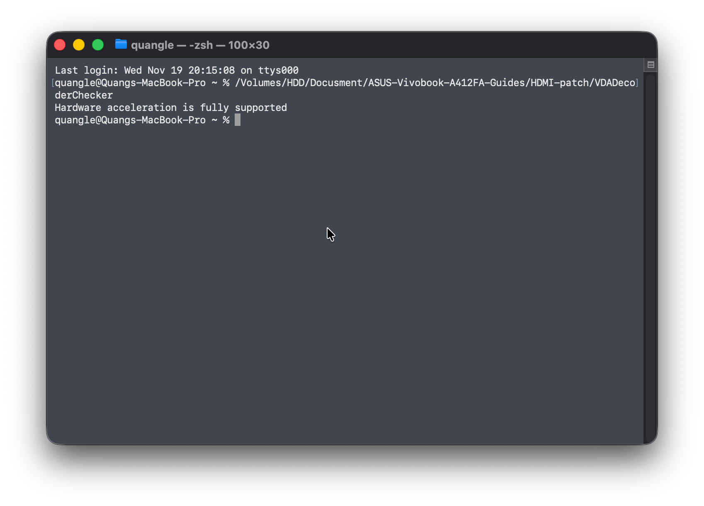

# Patch HDMI port

** Table of contents **
- [About](#about)
- [Requirements and Preparations](#requirements-and-preparations)
  - [Check hardware acceleration](#check-hardware-acceleration)

---

## About
After installing macOS on your laptop, the HDMI port may not work, this is because the connector is incorrectly mapped. Usually a connector patching or busid patching is required to get the HDMI port working

**Note**: This guide has a sample value for HDMI patching, this could help you save time *if it works*, if it does not work then you will have to follow the bus-id patching guide

## Preperation and requirements
- Working iGPU acceleration
- Plist editor ([ProperTree](https://github.com/corpnewt/ProperTree) is recommended)
- [VDADecoderChecker](./VDADecoderChecker)
- Time and patience

### Check hardware acceleration 
To have a fully working HDMI port, acceleration is required. To check if you have proper hardware acceleration, run [VDADecoderChecker](./VDADecoderChecker) inside the terminal. If you have working acceleration, the executable should return something like this:

If it returns something else, check for things in [this guide](https://dortania.github.io/OpenCore-Post-Install/universal/drm.html#testing-hardware-acceleration-and-decoding)
